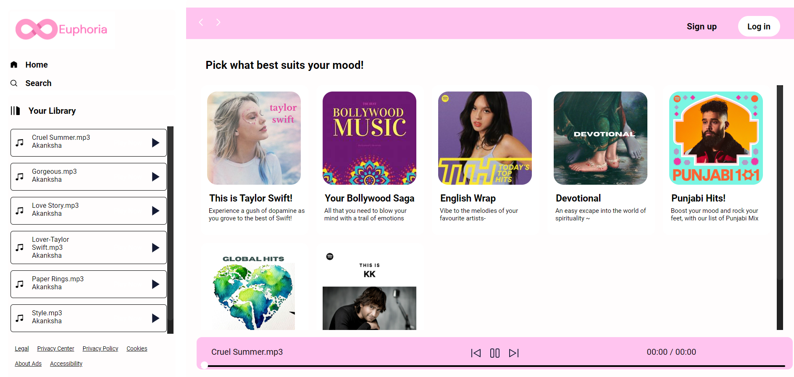
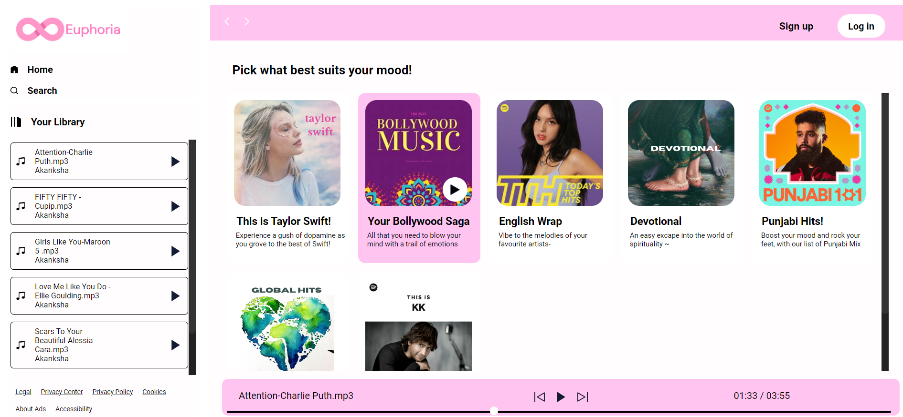

# Euphoria Music Web Application

Welcome to an interactive and user-friendly music web application, Euphoria, 
made using HTML, CSS, and JavaScript. It features a wide range of selectable playlists for everyone to explore. 
Users can choose from playlists of their preference, each displaying a curated list of songs.  
The website supports essential music playback functionalities, including play, pause, previous, and next options,  
providing an immersive and interactive music streaming experience.

### Home Page

### Playlist

## Features

- Wide range of selectable playlists
- Curated list of songs for each playlist
- Play, pause, previous, and next options
- User-friendly interface

